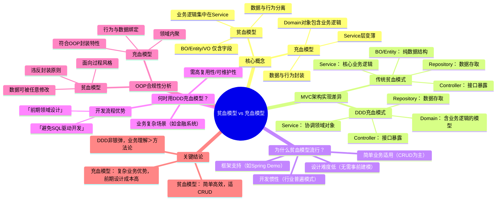

### 11 | 实战一（上）重点总结

#### 1. **贫血模型特点**
   - **数据结构与业务逻辑分离**：BO/Entity/VO 仅包含字段，业务逻辑集中在Service层
   - **典型分层**：
     - Controller：接口暴露 + VO传输
     - Service：业务逻辑 + BO转换
     - Repository：数据存取 + Entity映射
   - **违反OOP原则**：破坏封装性，属面向过程风格

#### 2. **充血模型特点**
   - **数据与行为封装**：Domain对象包含字段和业务方法（如`VirtualWallet.debit()`）
   - **分层变化**：
     - Service层变薄（协调领域对象）
     - Domain层成为核心
   - **符合OOP**：通过封装保障数据安全性和内聚性

#### 3. **贫血模型流行原因**
   - **业务适配性**：适合简单CRUD场景（占业务系统大多数）
   - **开发成本低**：无需前期领域设计，SQL驱动开发高效
   - **行业惯性**：主流框架（如Spring）默认模式

#### 4. **DDD充血模型适用场景**
   - **业务复杂度高**：如金融系统中的利息计算、风控规则
   - **长期维护需求**：通过领域设计提升代码复用性
   - **开发流程优势**：避免"SQL驱动开发"，以领域模型为核心迭代

#### 5. **关键结论**
| **维度**     | **贫血模型**             | **充血模型**           |
| ------------ | ------------------------ | ---------------------- |
| 业务适应性   | 简单CRUD系统             | 复杂业务系统（如金融） |
| OOP合规性    | 违反封装原则             | 符合面向对象封装特性   |
| 设计成本     | 低（即需即写Service）    | 高（需前期领域建模）   |
| 代码可维护性 | 随复杂度上升急剧下降     | 通过领域内聚更易维护   |
| 行业应用     | 当前主流（>90%业务系统） | 在复杂系统中逐步推广   |

> **课堂讨论答案**：  
> 1. **Entity/BO/VO不可合并**：  
>    - `UserEntity`映射数据库结构（可能含敏感字段）  
>    - `UserBo`是业务层传输对象（可能含计算字段）  
>    - `UserVo`适配接口展示（可能脱敏/格式化）  
>    **合并后果**：层间耦合，字段污染，违反单一职责原则。  
>
> 2. **模式选择经验**：  
>    - 报销系统（贫血模型）：快速交付但利息计算逻辑散落Service  
>    - 支付风控系统（充血模型）：前期设计成本高，但规则变更只需修改`RiskRuleDomain`类。

### 12 | 实战一（下）重点总结
