### 1.登录阿里云

##### 1.1访问 https://www.aliyun.com/ ，打开阿里云官网，并点击登录

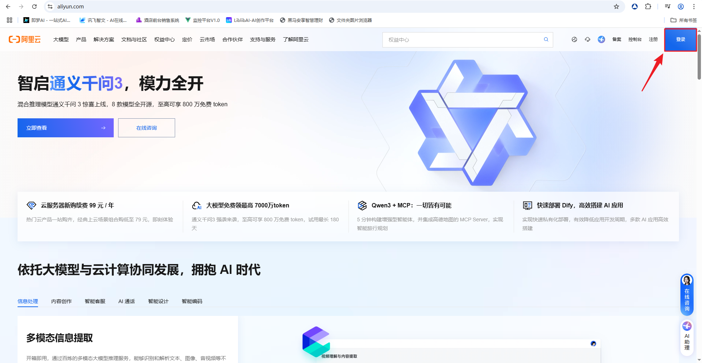

##### 1.2在弹出的页面中使用支付宝或者淘宝APP扫码登录

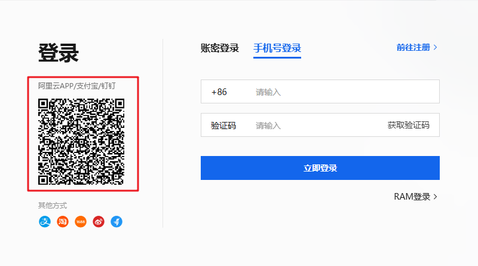

### 2.开通百炼服务

##### 2.1 选择产品：大模型服务平台百炼，并开通

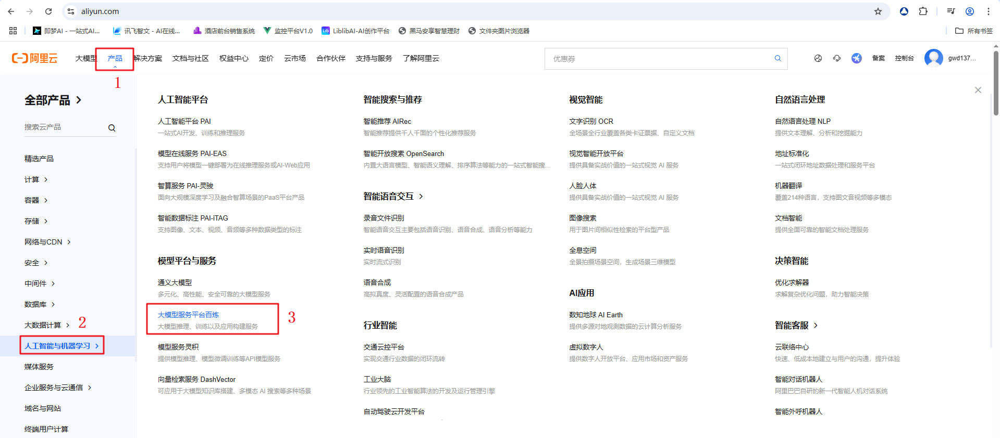

##### 2.2点击免费体验，打开百炼控制台

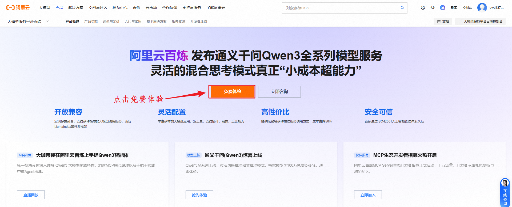

### 3.申请API-KEY

##### 3.1来到模型广场

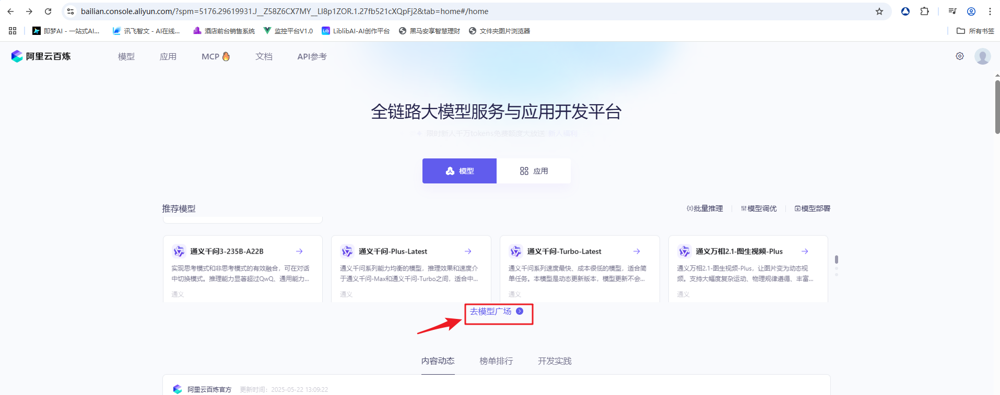

##### 3.2打开API-KEY管理页面

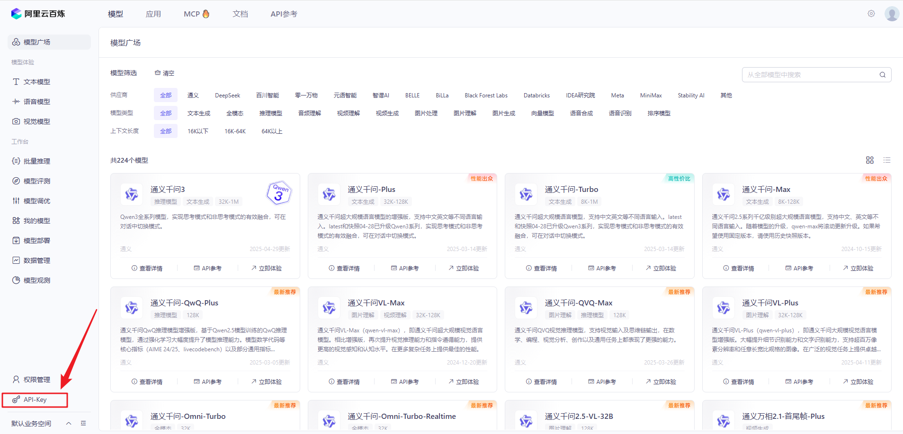

##### 3.3创建API-KEY

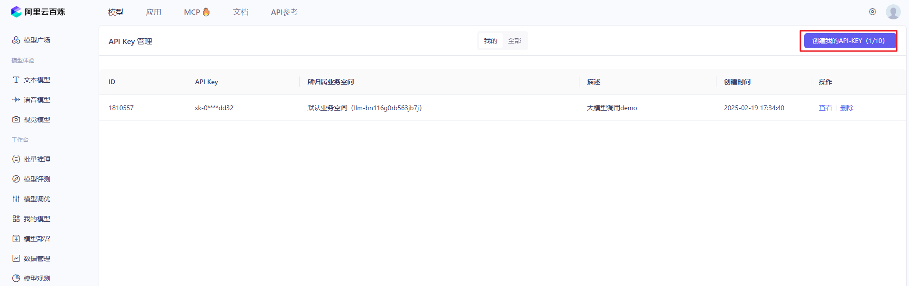

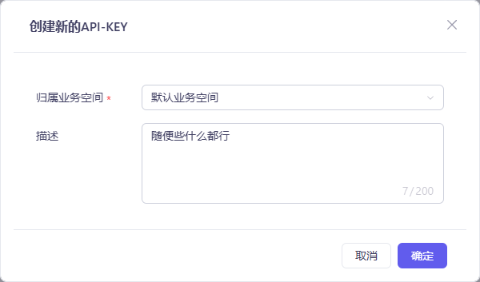

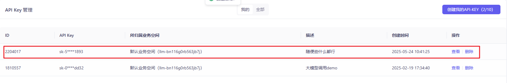

### 4.选择模型并使用

##### 4.1打开模型广场

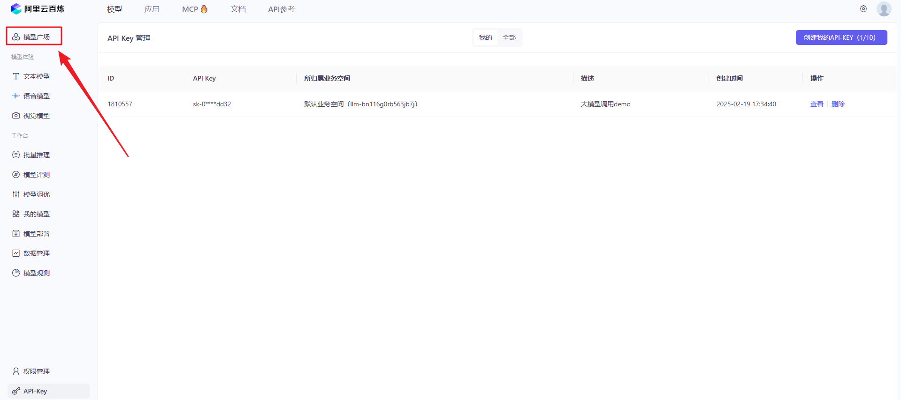

##### 4.2在模型广场中选择自己需要的模型，并点击API参考，查看使用方法

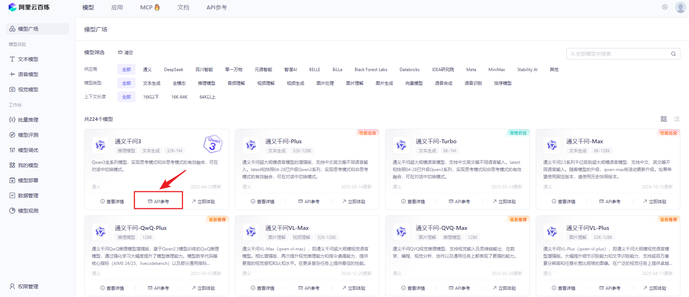

##### 4.3参考文档使用即可

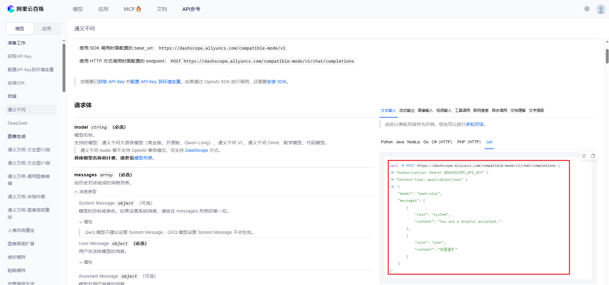

### 5.使用Apifox工具调用大模型

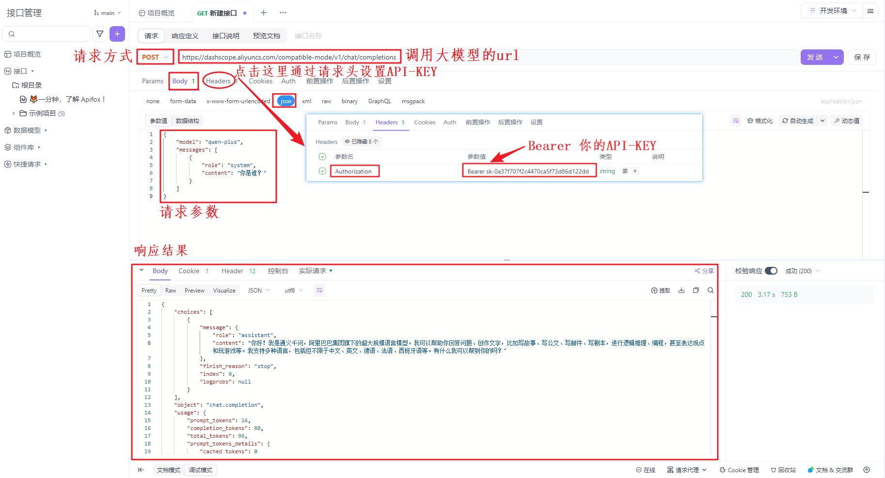

